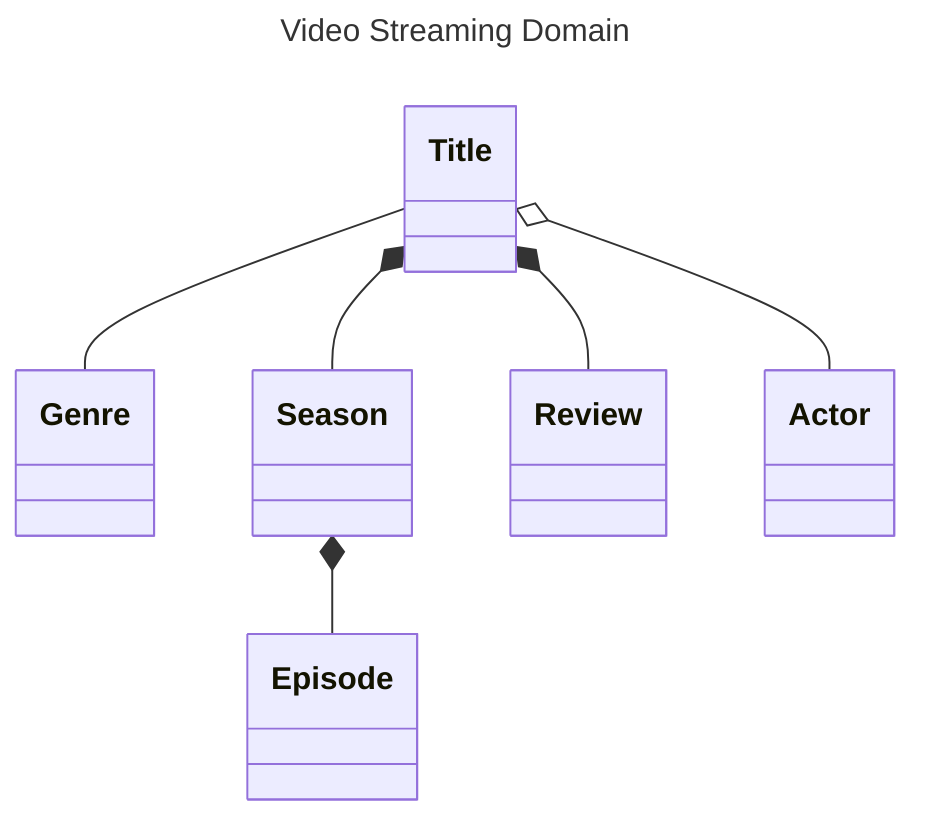

# Basic UML

## Question: in UML diagram, what is aggregation, composition and association

> Bard response

In UML diagrams, aggregation, composition, and association are three different types of relationships that can be used to show the connections between objects.

- **Aggregation** is a relationship between two objects where the objects are considered to be parts of a whole. For example, a car is composed of many parts, such as an engine, a transmission, and a body. In an aggregation relationship, the part objects can exist independently of the whole object.
- **Composition** is a stronger form of aggregation where the part objects cannot exist independently of the whole object. For example, a cell is composed of many organelles, such as the nucleus, the endoplasmic reticulum, and the mitochondria. In a composition relationship, if the whole object is deleted, the part objects are also deleted.
- **Association** is a relationship between two objects where the objects are simply connected to each other. For example, a student is associated with many classes, and a class is associated with many students. In an association relationship, the objects can exist independently of each other.

The type of relationship that is used in a UML diagram depends on the nature of the relationship between the objects. For example, if the objects are considered to be parts of a whole, then an aggregation relationship should be used. If the part objects cannot exist independently of the whole object, then a composition relationship should be used. If the objects are simply connected to each other, then an association relationship should be used.

