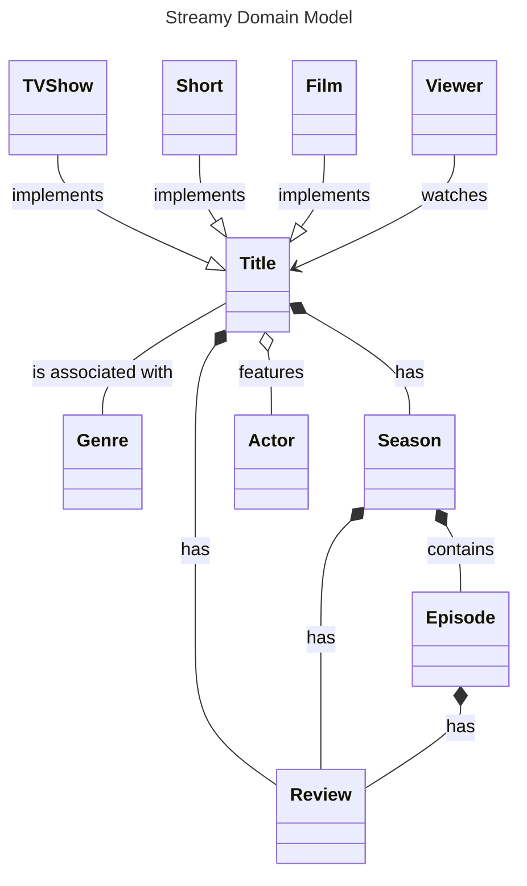
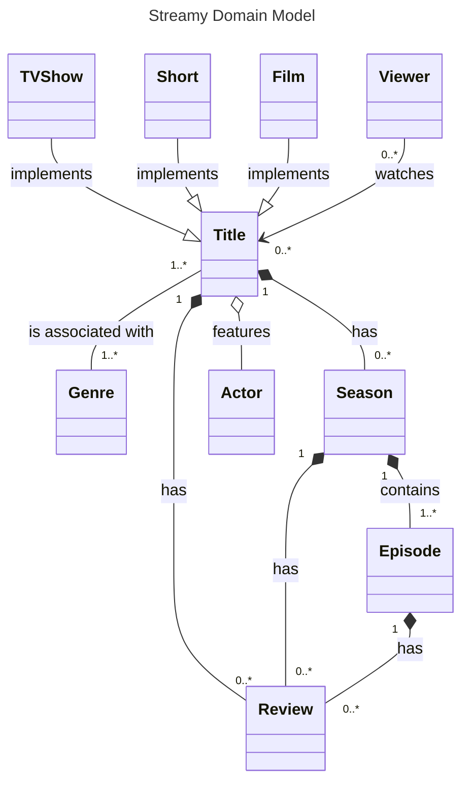

# Enhance model

## Describe Relationships

```mermaid
---
title: Streamy Domain Model
notes: https://t2informatik.de/en/smartpedia/uml/
---
classDiagram
    %% Association: Two entities tha are loosely related and can exist
    %% independent of one another.
    %% Bidirectional association.
    Title -- Genre: is associated with

    %% Composition: Two entities that are tightly related and cannot exist
    %% independently of one another.
    %% Aka parent-child relationship, where child cannot exists without parent.
    Title *-- Season: has
    Title *-- Review: has

    %% Aggregation: "is part-of" relationship. If the parent is deleted, the child can still exists.
    Title o-- Actor: features

    %% Inheritance
    TV Show --|> Title: implements
    Short --|> Title: implements
    Film --|> Title: implements

    %% Directional association.
    Viewer --> Title: watches

    Season *-- Review: has
    Season *-- Episode: contains

    Episode *-- Review: has
```

## Add Multiplicity

Instead of using singular/plural names when naming entities in diagram, use multiplicity in diagram.

```mermaid
---
title: Streamy Domain Model
notes: https://t2informatik.de/en/smartpedia/uml/
---
classDiagram
    %% Association: Two entities tha are loosely related and can exist
    %% independent of one another.
    %% Bidirectional association.
    Title "1..*" -- "1..*" Genre: is associated with

    %% Composition: Two entities that are tightly related and cannot exist
    %% independently of one another.
    %% Aka parent-child relationship, where child cannot exists without parent.
    %% An entity's cardinality is defined on the opposite side of the relationship.
    %% Title has zero to many Seasons.
    %% Season belongs to one Title.
    Title "1" *-- "0..*" Season: has
    Title "1" *-- "0..*" Review: has

    %% Aggregation: "is part-of" relationship. If the parent is deleted, the child can still exists.
    Title o-- Actor: features

    %% Inheritance
    TV Show --|> Title: implements
    Short --|> Title: implements
    Film --|> Title: implements

    %% Directional association.
    Viewer "0..*" --> "0..*" Title: watches

    Season "1" *-- "0..*" Review: has
    Season "1" *-- "1..*" Episode: contains

    Episode "1" *-- "0..*" Review: has

		%% Adding link.
		link Title "https://www.google.com" _blank
```
