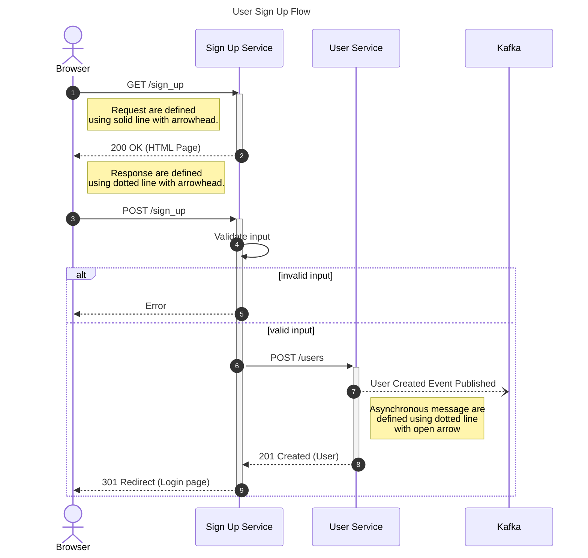

# Visualize Application and User Flow

Using sequence diagram to model the flow for a user signing up for Streamy.

## Define Actors and Participants

```mermaid
---
title: User Sign Up Flow
link: https://mermaid.js.org/syntax/sequenceDiagram.html#messages
---
sequenceDiagram
    %% Automatically adds sequence number.
    autonumber
    actor Browser
    participant SUS as Sign Up Service
    participant User Service
    participant Kafka
    links User Service: {"Repository": "https://github.com"}

    %% The first interaction is user requesting the sign up page.
    Browser->>SUS: GET /sign_up
    activate SUS
    Note right of Browser: Request are defined<br/>using solid line with arrowhead.
    SUS-->>Browser: 200 OK (HTML Page)
    deactivate SUS
    Note right of Browser: Response are defined<br/>using dotted line with arrowhead.

    %% Displaying length of interfaction using +/- at the end of the arrowhead.
    Browser->>+SUS: POST /sign_up
    SUS->>SUS: Validate input

    %% Show branching logic.
    alt invalid input
        SUS-->>Browser: Error
    else valid input
        SUS->>+User Service: POST /users
        %% Display asynchronous messages.
        User Service--)Kafka: User Created Event Published
        Note right of User Service: Asynchronous message are<br/>defined using dotted line<br/>with open arrow
        User Service-->>-SUS: 201 Created (User)
        SUS-->>-Browser: 301 Redirect (Login page)
    end
```
