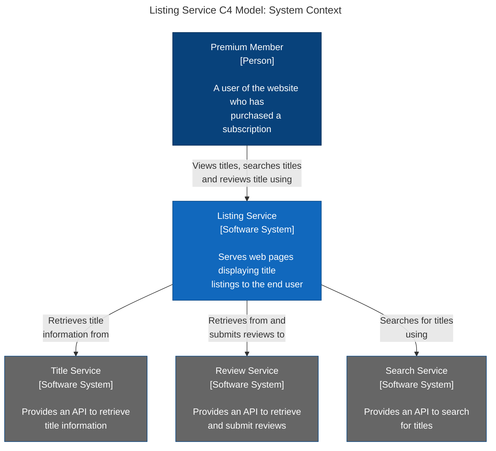
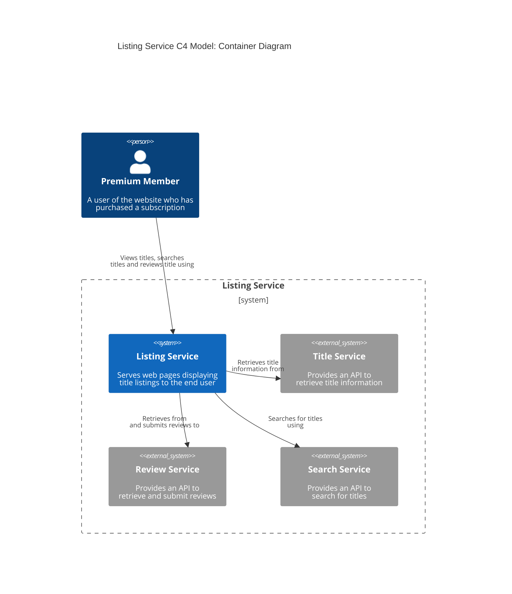

# Model Your Architecture

Using C4 model:
- system context
- container
- component
- code

## Creating a System Context Diagram

```mermaid
---
title: "Listing Service C4 Model: System Context"
---
%% TD: top-down
flowchart TD
    %% Each node should contain a title, label and description.
    User["
        Premium Member
        [Person]

        A user of the website who has
        purchased a subscription
    "]

    LS["
        Listing Service
        [Software System]

        Serves web pages displaying title
        listings to the end user
    "]

    TS["
        Title Service
        [Software System]

        Provides an API to retrieve
        title information
    "]

    RS["
        Review Service
        [Software System]

        Provides an API to retrieve
        and submit reviews
    "]

    SS["
        Search Service
        [Software System]

        Provides an API to search
        for titles
    "]

    User -- "Views titles, searches titles\nand reviews title using" --> LS
    LS -- "Retrieves title\ninformation from" --> TS
    LS -- "Retrieves from and\nsubmits reviews to" --> RS
    LS -- "Searches for titles\nusing" --> SS

    %% Define classes using syntax "classDef className styleProperties".
    classDef focusSystem fill:#1168bd,stroke:#0b4884,color:white
    classDef supportingSystem fill:#666,stroke:#0b4884,color:white
    classDef person fill:#08427b,stroke:#052e56,color:white

    %% Apply style using syntax "class nodeId(s) className".
    class LS focusSystem
    class TS,RS,SS supportingSystem
    class User person
```

## Using Mermaid C4Context

```mermaid
C4Context
    title Listing Service C4 Model: Container Diagram
    Person(PM, "Premium Member", "A user of the website who has<br/> purchased a subscription")

    Boundary(b0, "Listing Service") {
        System(LS, "Listing Service", "Serves web pages displaying<br/> title listings to the end user")
        System_Ext(TS, "Title Service", "Provides an API to <br/>retrieve title information")
        System_Ext(RS, "Review Service", "Provides an API to <br/>retrieve and submit reviews")
        System_Ext(SS, "Search Service", "Provides an API to <br/>search for titles")
    }

    Rel(PM, LS, "Views titles, searches <br/>titles and reviews title using")
    Rel(LS, TS, "Retrieves title<br/>information from")
    Rel(LS, RS, "Retrieves from<br/>and submits reviews to")
    Rel(LS, SS, "Searches for titles<br/> using")

    UpdateRelStyle(PM, LS, $offsetX="-100", $offsetY="-30")
    UpdateRelStyle(LS, TS, $offsetX="-40", $offsetY="-20")
    UpdateRelStyle(LS, RS, $offsetX="-100", $offsetY="0")
    UpdateRelStyle(LS, SS, $offsetX="20", $offsetY="0")

    UpdateLayoutConfig($c4ShapeInRow="2", $c4BoundaryInRow="1")
```
