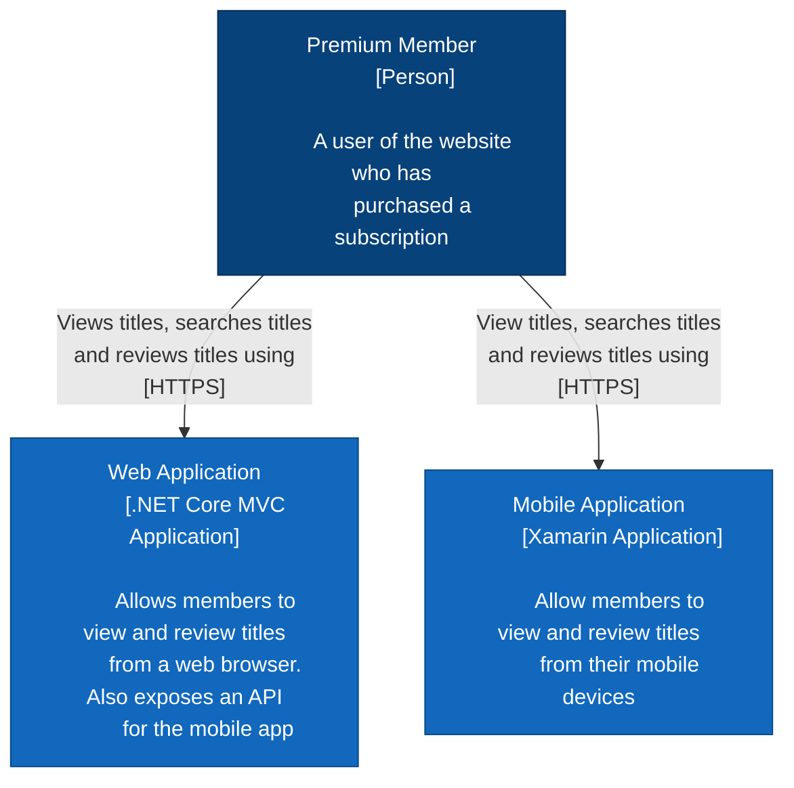
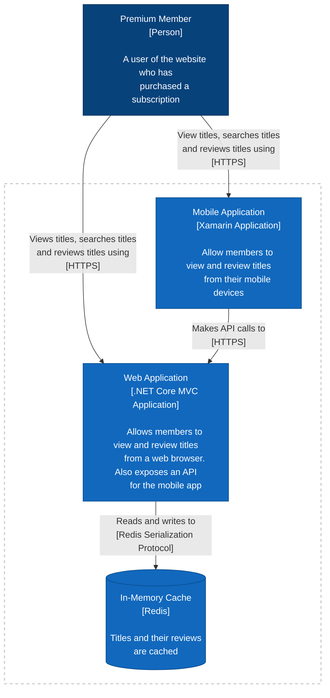
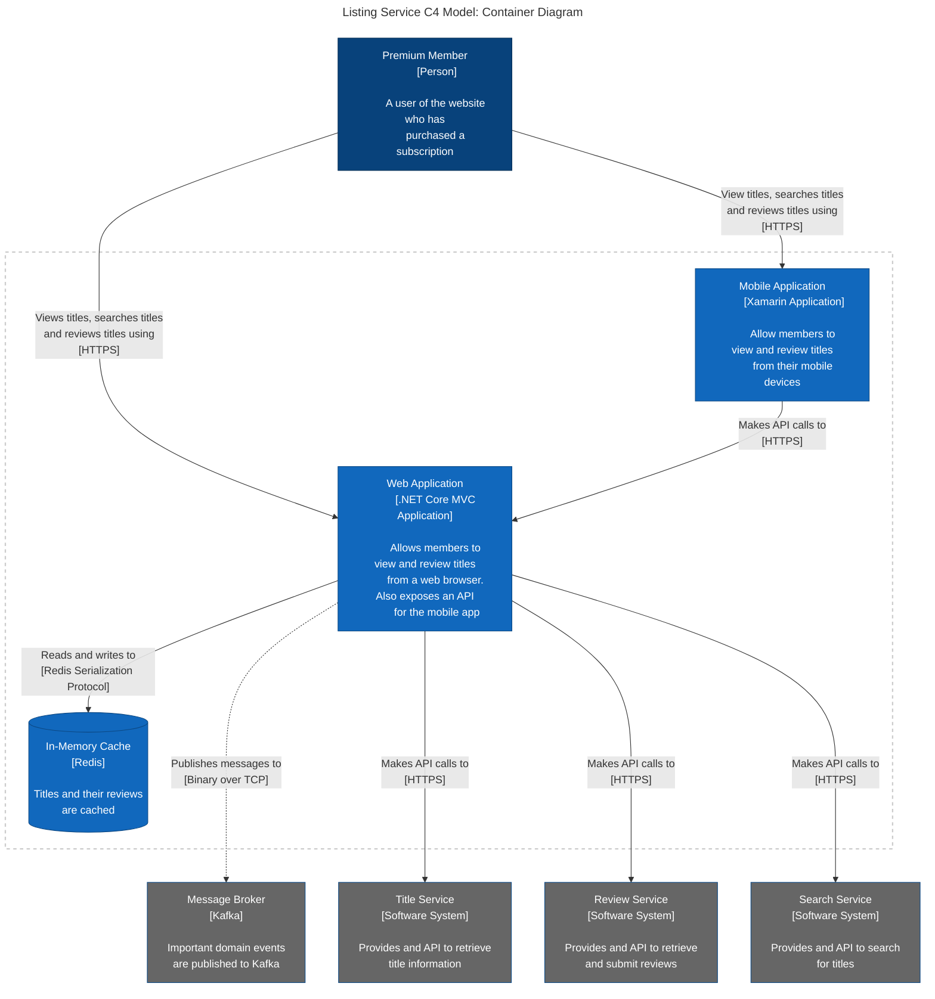

# Detail your system container

```mermaid
flowchart TD
    User["Premium Member
        [Person]

        A user of the website who has
        purchased a subscription
    "]

    WA["Web Application
        [.NET Core MVC Application]

        Allows members to view and review titles
        from a web browser. Also exposes an API
        for the mobile app
    "]

    MA["Mobile Application
        [Xamarin Application]

        Allow members to view and review titles
        from their mobile devices
    "]

    User -- "Views titles, searches titles
    and reviews titles using
    [HTTPS]"--> WA
    User --"View titles, searches titles
    and reviews titles using
    [HTTPS]"--> MA

    %% Define classes using syntax "classDef className styleProperties".
    classDef container fill:#1168bd,stroke:#0b4884,color:white
    classDef person fill:#08427b,stroke:#052e56,color:white

    %% Apply style using syntax "class nodeId(s) className".
    class WA,MA container
    class User person
```

## Create clear boundaries with Subgraph

```mermaid
flowchart TD
    User["Premium Member
        [Person]

        A user of the website who has
        purchased a subscription
    "]

    WA["Web Application
        [.NET Core MVC Application]

        Allows members to view and review titles
        from a web browser. Also exposes an API
        for the mobile app
    "]

    MA["Mobile Application
        [Xamarin Application]

        Allow members to view and review titles
        from their mobile devices
    "]

    R[("In-Memory Cache
        [Redis]

        Titles and their reviews
        are cached
    ")]

    User -- "Views titles, searches titles
    and reviews titles using
    [HTTPS]"--> WA
    User --"View titles, searches titles
    and reviews titles using
    [HTTPS]"--> MA

    subgraph listing-service[Listing Service]
        MA -- "Makes API calls to \n[HTTPS]" --> WA
        WA -- "Reads and writes to\n[Redis Serialization Protocol]" --> R
    end

    %% Define classes using syntax "classDef className styleProperties".
    classDef container fill:#1168bd,stroke:#0b4884,color:white
    classDef person fill:#08427b,stroke:#052e56,color:white

    %% Apply style using syntax "class nodeId(s) className".
    class WA,MA,R container
    class User person

    style listing-service fill:none,stroke:#ccc,stroke-width:2px
    style listing-service color:#fff,stroke-dasharray: 5 5
```

## Add supporting systems

```mermaid
---
title: "Listing Service C4 Model: Container Diagram"
---
flowchart TD
    User["Premium Member
        [Person]

        A user of the website who has
        purchased a subscription
    "]

    WA["Web Application
        [.NET Core MVC Application]

        Allows members to view and review titles
        from a web browser. Also exposes an API
        for the mobile app
    "]

    MA["Mobile Application
        [Xamarin Application]

        Allow members to view and review titles
        from their mobile devices
    "]

    R[("In-Memory Cache
        [Redis]

        Titles and their reviews
        are cached
    ")]
    K["Message Broker
        [Kafka]

        Important domain events\nare published to Kafka
    "]

    TS["Title Service
        [Software System]

        Provides and API to retrieve
        title information
    "]

    RS["Review Service
        [Software System]

        Provides and API to retrieve
        and submit reviews
    "]

    SS["Search Service
        [Software System]

        Provides and API to search
        for titles
    "]

    User -- "Views titles, searches titles
    and reviews titles using
    [HTTPS]"--> WA
    User --"View titles, searches titles
    and reviews titles using
    [HTTPS]"--> MA

    subgraph listing-service[Listing Service]
        WA -- "Reads and writes to\n[Redis Serialization Protocol]" --> R

        MA -- "Makes API calls to \n[HTTPS]" --> WA
    end

    %% Using dotted line to represent asynchronous interactions.
    WA -. "Publishes messages to\n[Binary over TCP]" ..-> K
    WA -- "Makes API calls to\n[HTTPS]" ---> TS
    WA -- "Makes API calls to\n[HTTPS]" ---> RS
    WA -- "Makes API calls to\n[HTTPS]" ---> SS

    %% Define classes using syntax "classDef className styleProperties".
    classDef container fill:#1168bd,stroke:#0b4884,color:white
    classDef supportingSystem fill:#666,stroke:#0b4884,color:white
    classDef person fill:#08427b,stroke:#052e56,color:white

    %% Apply style using syntax "class nodeId(s) className".
    class WA,MA,R container
    class User person
    class TS,RS,SS,K supportingSystem
    style listing-service fill:none,stroke:#ccc,stroke-width:2px
    style listing-service color:#fff,stroke-dasharray: 5 5
```
