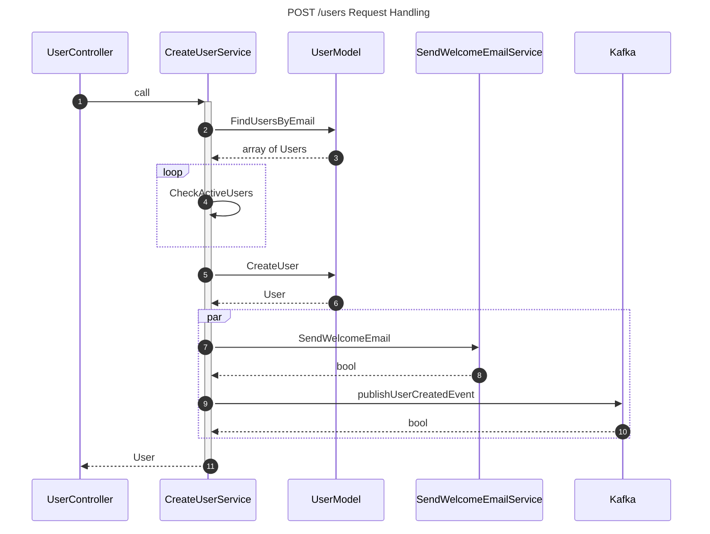

# Visualize Code Flows

```mermaid
---
title: POST /users Request Handling
---
sequenceDiagram
    autonumber

    participant UserController
    participant CreateUserService
    participant UserModel
    participant SendWelcomeEmailService
    participant Kafka

    UserController->>+CreateUserService: call
    CreateUserService->>UserModel: FindUsersByEmail
    UserModel-->>CreateUserService: array of Users

    loop
        CreateUserService->>CreateUserService: CheckActiveUsers
    end

    CreateUserService->>UserModel: CreateUser
    UserModel-->>CreateUserService: User

    par
        CreateUserService->>SendWelcomeEmailService: SendWelcomeEmail
        SendWelcomeEmailService-->>CreateUserService: bool

        CreateUserService->>Kafka: publishUserCreatedEvent
        Kafka-->>CreateUserService: bool
    end

    CreateUserService-->>-UserController: User
```
