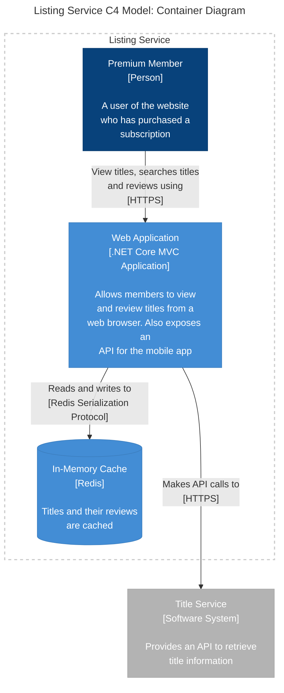

# learn-mermaid

```mermaid
---
title: "Listing Service C4 Model: Container Diagram"
---
flowchart TD
    %% Styles
    classDef person fill:#08427B,stroke:#073B6F,color:white
    classDef container fill:#438DD5,stroke:#3C7FC0,color:white
    classDef container_ext fill:#B3B3B3,stroke:#A6A6A6,color:white

    %% Tips: Add a new line every 4-5 words.
    p0["Premium Member\n[Person]\n\nA user of the website\nwho has purchased a\nsubscription"]
    web0["Web Application\n[.NET Core MVC Application]\n\nAllows members to view\nand review titles from a\nweb browser. Also exposes an\nAPI for the mobile app"]
    cache0[("In-Memory Cache\n[Redis]\n\nTitles and their reviews\nare cached")]

    %% Services
    tsvc["Title Service\n[Software System]\n\nProvides an API to retrieve\ntitle information"]

    subgraph boundary["Listing Service"]
        %% Your boundary here
        p0 -- "View titles, searches titles\nand reviews using\n[HTTPS]" --> web0
        web0 -- "Reads and writes to\n[Redis Serialization Protocol]" --> cache0
    end


    web0 -- "Makes API calls to\n[HTTPS]" ---> tsvc

    class p0 person
    class web0,cache0 container
    class tsvc container_ext
    style boundary fill:none,stroke:#ccc,stroke-width:2px,stroke-dasharray: 5 5
```
