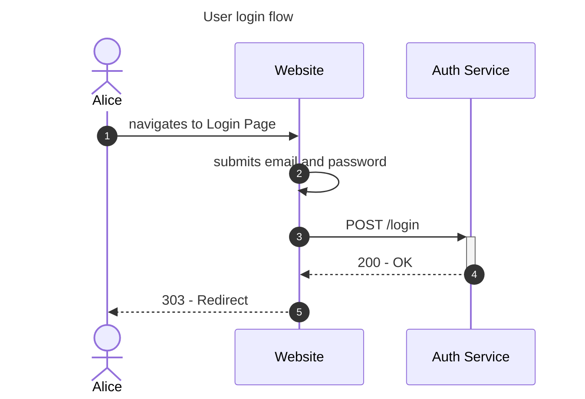

# How to document Usecase?

We can use either

- sequence diagram
- flowchart

## Do we need to show all the possible errors/failure case?

Nope, just write them separately as text, e.g. in the diagram above, we have the numbering for each steps. So we can use `A1, A2, ... AN` to indicate **alternative** paths.

- A1. Page not found? End usecase
- A2. Email or password not provided or invalid? Show error message.
- A3. Service is down? Show error message

## Sometimes representing it as table is more convenient

| Flow | Alternative |
| -- | -- |
| 1. User navigates to Login Page | A1. Page not found |
| 2. User submits email and password | A2. Email or password not provided or invalid? Show error message. |
| 3. Client sends the request to the system | A3. Service is down? Show error message |
| 4. System logins the user and returns access token | A4. User not found? Return error |
| 5. System redirects the user to the home page | |

1. user navigates to login page
    - A1. page not found
2. user submits email and password
    - A2. email or password is invalid? show error message
3. client sends the request to the system
    - A3. service is down? show error message
4. system logins the user and returns access token
    - A4. user not found? return error
5. system redirects the user to the home page

<table>
<thead>
    <tr>
        <th>Flow</th>
        <th>Alternative</th>
    </tr>
</thead>
<tbody>
    <tr>
        <td>
            <ol>
                <li>User navigates to Login Page</li>
                <li>User submits email and password</li>
                <li>Client sends the request to the system</li>
                <li>System logins the user and returns access token</li>
                <li>System redirects the user to the home page</li>
            </ol>
        </td>
        <td>
            <ol>
                <li>Page not found</li>
                <li>Email or password not provided or invalid? Show error message.</li>
                <li>Service is down? Show error message</li>
                <li>User not found? Return error</li>
            </ol>
        </td>
    </tr>
</tbody>
</table>
